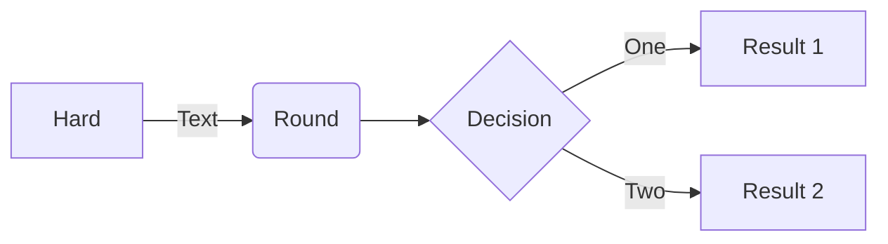

# My Project

My Description

# To run the main program, first start the virtual environment, then execute the app module
## Create and install dependencies, if necessary
```sh
pyenv activate knowledge-base-explorer-env
```
```sh
python explorer/app.py
```
## Run in debug mode
```sh
python explorer/app.py -d
```
## To get help
```sh
python explorer/app.py -h
```

## Reference
https://docs.python-guide.org/writing/structure/

## ToDo
* write tests
* Move to uv based workflow
* add features from knowledgebaseinterface from replit agent
* test new layout

### _sample mermaid chart_

